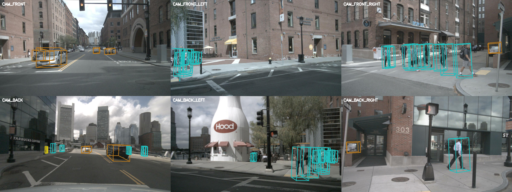

# FastBEV C++ 推理

FastBEV 3D 目标检测的 C++ 推理实现，基于 OpenCV DNN 加载 ONNX 模型。从 Python 版本移植，Feature→BEV 部分使用 OpenMP 并行加速，GPU 模式下额外使用 CUDA kernel。

## 环境要求

| 依赖 | 版本要求 | 说明 |
|------|----------|------|
| GCC | >= 7 | C++17 |
| CMake | >= 3.10 | |
| OpenCV | 4.x（源码编译） | 需带 CUDA / DNN 模块 |
| nlohmann-json | 3.x | `sudo apt install nlohmann-json3-dev` |
| OpenMP | 已包含在 GCC 中 | 编译时自动检测 |
| CUDA | 11.x（可选） | GPU 推理 + CUDA kernel 加速 |

### OpenCV 源码编译（GPU 模式必需）

GPU 模式需要 OpenCV 带 `opencv_contrib` 模块和 CUDA 支持，不能用 `apt install` 的版本，必须源码编译。核心 CMake 选项：

```bash
cmake \
  -D WITH_CUDA=ON \
  -D WITH_CUDNN=ON \
  -D OPENCV_DNN_CUDA=ON \
  -D OPENCV_EXTRA_MODULES_PATH=/path/to/opencv_contrib/modules \
  ...
```

编译完成后确认 CUDA DNN 可用：

```bash
grep -i cuda /usr/local/lib/cmake/opencv4/OpenCVModules.cmake | head
```

### CUDA（可选）

- CUDA Toolkit 11.x（本机使用 11.7）
- 编译时未检测到 CUDA 则自动跳过 CUDA kernel，Feature→BEV 走 OpenMP CPU 路径
- 运行时 GPU 不可用会自动降级到 CPU，无需手动干预

## 项目结构

```
.
├── main_single.cpp        # 单张图片推理入口
├── main_video.cpp         # 场景视频推理入口
├── CMakeLists.txt
├── build.sh               # 编译脚本
├── run_image.sh           # 运行单张图片推理
├── run_video.sh           # 运行场景视频推理
├── infer/                 # 推理引擎 FastBEVInfer
├── loader/                # NuScenes 数据加载、标定、投影矩阵
├── backproject/           # 2D 特征 → 3D BEV 体素（原始实现）
├── optimize/              # Feature→BEV 优化（OpenMP + CUDA kernel）
├── postprocess/           # Anchor 生成、框解码、NMS
├── visualize/             # BEV / 相机可视化
├── models/                # ONNX 模型文件
├── data/                  # NuScenes v1.0-mini 数据集
├── images/                # 导出的相机图像（运行时）
└── output/                # 可视化结果（运行时）
```

## 效果演示

### 单帧推理 — 相机视角 3D 检测框



### 场景视频 — BEV 鸟瞰连续推理


> 点击 [bev_scene.mp4](output/bev_scene.mp4) 下载完整画质视频（1800x1200）。

## 加速策略

- **Feature→BEV 统一使用 OpenMP 并行**：NHWC→NCHW 转置、体素遍历回投、scatter 写入均由 OpenMP 多线程加速
- **GPU 模式下**：核心回投计算由 CUDA kernel 执行（每个 `(image, x, y)` 一个线程），其余 CPU 侧操作（转置、scatter）仍用 OpenMP
- **无 GPU 时**：全部回退到 OpenMP CPU 路径（`--no-gpu` 或自动检测）

## 使用方法

### 编译

```bash
bash build.sh
```

### 查看可用 Token

运行前可以先查看数据集中的 sample token 和 scene token：

```bash
# 列出 sample tokens（按 scene 分组）
bash run_image.sh --list-tokens
bash run_image.sh --list-tokens 20    # 只显示前 20 个

# 列出 scene tokens
bash run_video.sh --list-scenes

# 列出 sample tokens（视频模式下）
bash run_video.sh --list-tokens
```

### 单张图片推理

```bash
# GPU（默认 token）
bash run_image.sh

# 指定 token
bash run_image.sh 你的SAMPLE_TOKEN

# CPU
bash run_image.sh 你的SAMPLE_TOKEN --no-gpu

# 调整分数阈值
bash run_image.sh 你的SAMPLE_TOKEN --score-thr 0.1

# 跳过图像导出（图像已存在）
bash run_image.sh 你的SAMPLE_TOKEN --no-export
```

### 场景视频推理

对某个 scene 的所有 sample 逐帧推理，生成摄像头 + BEV 组合视频：

```bash
# GPU（默认 scene）
bash run_video.sh

# 指定 scene
bash run_video.sh 你的SCENE_TOKEN

# CPU，5 fps
bash run_video.sh 你的SCENE_TOKEN --no-gpu --fps 5

# 自定义输出路径
bash run_video.sh 你的SCENE_TOKEN --out-video output/my_scene.mp4
```

视频布局为三行：
- **上排**：CAM_FRONT_LEFT, CAM_FRONT, CAM_FRONT_RIGHT
- **中排**：BEV 鸟瞰感知结果
- **下排**：CAM_BACK_LEFT, CAM_BACK, CAM_BACK_RIGHT

### 直接调用可执行文件

```bash
# 编译
bash build.sh

# 单张图片
./build/fastbev_infer --list-tokens
./build/fastbev_infer --token 你的SAMPLE_TOKEN
./build/fastbev_infer --token 你的SAMPLE_TOKEN --no-gpu --score-thr 0.1

# 场景视频
./build/fastbev_video --list-scenes
./build/fastbev_video --list-tokens
./build/fastbev_video --scene 你的SCENE_TOKEN
./build/fastbev_video --scene 你的SCENE_TOKEN --no-gpu --fps 5
```

### 单张图片完整参数

```
./build/fastbev_infer --token SAMPLE_TOKEN [选项]
./build/fastbev_infer --list-tokens [N]

必填:
  --token TOKEN         NuScenes sample token

可选:
  --list-tokens [N]     列出可用的 sample tokens（按 scene 分组，默认 50）
  --model-2d PATH       2D ONNX 模型路径（默认: models/fastbev_2d.onnx）
  --model-3d PATH       3D ONNX 模型路径（默认: models/fastbev_3d.onnx）
  --nuscenes-root DIR   NuScenes 数据目录（默认: data）
  --dataroot DIR        NuScenes 图像根目录（默认: data）
  --image-dir DIR       导出图像的临时目录（默认: images）
  --out-dir DIR         可视化输出目录（默认: output）
  --score-thr FLOAT     检测分数阈值（默认: 0.3）
  --no-gpu              使用 CPU 推理
  --no-export           跳过图像导出（图像已存在时使用）
```

### 场景视频完整参数

```
./build/fastbev_video --scene SCENE_TOKEN [选项]
./build/fastbev_video --list-scenes
./build/fastbev_video --list-tokens [N]

必填:
  --scene TOKEN         NuScenes scene token

可选:
  --list-scenes         列出所有 scene tokens
  --list-tokens [N]     列出可用的 sample tokens（按 scene 分组，默认 50）
  --no-gpu              使用 CPU 推理
  --no-export           跳过图像导出（图像已存在时使用）
  --fps N               视频帧率（默认: 10）
  --out-video PATH      输出视频路径（默认: output/bev_scene.mp4）
  --score-thr FLOAT     检测分数阈值（默认: 0.15）
  --model-2d PATH       2D ONNX 模型路径
  --model-3d PATH       3D ONNX 模型路径
  --nuscenes-root DIR   NuScenes 数据目录
  --dataroot DIR        NuScenes 图像根目录
  --image-dir DIR       导出图像的临时目录
  --out-dir DIR         输出目录
```

## 性能对比

测试环境：Intel i5-12400F (6C12T) + RTX 3060 12GB + CUDA 11.7

| 阶段 | CPU (ms) | GPU (ms) | 加速比 |
|------|----------|----------|--------|
| 数据预处理 | 95 | 100 | — |
| 2D 模型推理 | 1160 | 45 | **25.8x** |
| Feature → BEV | 360 | 300 | 1.2x |
| 3D 模型推理 | 525 | 45 | **11.7x** |
| 后处理 (NMS) | 3 | 2 | — |
| **总计** | **2143** | **492** | **4.4x** |

说明：
- 数据预处理纯 CPU 操作（imread/resize/normalize），CPU/GPU 时间基本相同，OpenMP 并行化后从 220ms 降至 ~100ms
- 2D / 3D 模型推理在 GPU 上使用 `DNN_TARGET_CUDA_FP16`
- Feature→BEV 的 CPU 路径由 OpenMP 全并行，GPU 路径受限于 H2D/D2H 数据搬运，二者差距不大
