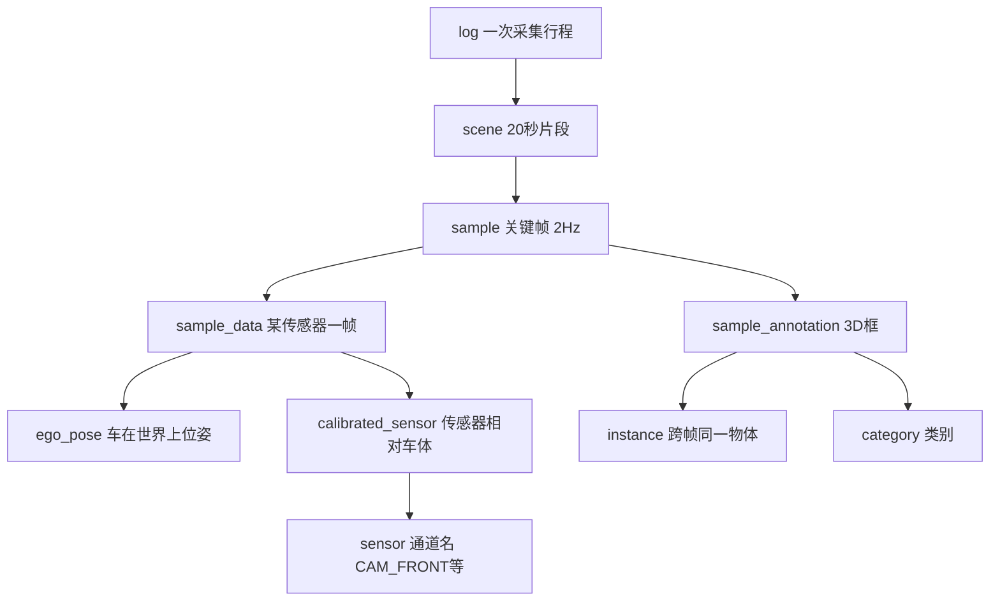

# nuScenes v1.0-mini（本仓库副本）

本目录是 [nuScenes](https://www.nuscenes.org/) 官方 **v1.0-mini** 子集的一份本地拷贝，供 `tools/infer/` 做标定查询、时序 keyframe 链、以及（可选）直接读取传感器文件。

> 官方说明见 `.v1.0-mini.txt`。完整文档：[nuScenes devkit](https://github.com/nutonomy/nuscenes-devkit)。

---

## 目录结构一览

```
tools/infer/v1.0-mini/
├── README.md                 # 本文档
├── .v1.0-mini.txt            # 官方下载说明
├── v1.0-mini/                # ★ 元数据（JSON 表），infer 主要读这里
│   ├── sample.json
│   ├── sample_data.json
│   ├── calibrated_sensor.json
│   ├── ego_pose.json
│   └── …（见下文各表说明）
├── samples/                  # keyframe 传感器数据（与 JSON 中 filename 对应）
│   ├── CAM_FRONT/*.jpg
│   ├── CAM_* …（6 路相机）
│   ├── LIDAR_TOP/*.pcd.bin
│   └── RADAR_*/*.pcd
├── sweeps/                   # 非 keyframe 的中间帧（更高频）
│   └── （各通道子目录）
└── maps/                     # 4 张鸟瞰语义地图 PNG
```

| 路径 | 体积（约） | 作用 |
|------|------------|------|
| `v1.0-mini/` | ~32 MB | 关系型元数据，**无像素/点云**，全是 JSON |
| `samples/` | ~706 MB | 每个 **sample（关键帧）** 各传感器一帧 |
| `sweeps/` | ~508 MB | sample 之间的 **中间扫描** |
| `maps/` | ~5.6 MB | 高精地图栅格图 |

**规模（本副本统计）**

| 项目 | 数量 |
|------|------|
| 场景 `scene` | 10 |
| 关键帧 `sample` | 404（每场景约 39–41 帧，2 Hz） |
| 传感器记录 `sample_data` | 31,206（含 keyframe + sweep） |
| 3D 标注 `sample_annotation` | 18,538 |
| 跟踪实例 `instance` | 911 |
| 位姿 `ego_pose` | 31,206（与 sample_data 一一对应） |
| 标定 `calibrated_sensor` | 120（每 log 一套传感器外参+内参） |

10 个场景名：`scene-0061`, `scene-0103`, `scene-0553`, `scene-0655`, `scene-0757`, `scene-0796`, `scene-0916`, `scene-1077`, `scene-1094`, `scene-1100`。

---

## 核心概念：数据怎么串起来

nuScenes 用 **token（UUID 字符串）** 把表连在一起，可以把它想成数据库里的外键。



**时间轴**

- 一个 **scene** ≈ 20 秒，包含一串 **sample**（关键帧，约每 0.5 s 一帧）。
- 每个 sample 上，6 相机 + 1 LiDAR + 5 Radar 各有一条 **keyframe** 的 `sample_data`（`is_key_frame=true`，文件在 `samples/`）。
- 两个 sample 之间还有更密的 **sweep**（`is_key_frame=false`，文件在 `sweeps/`）。FastBEV infer **只用 keyframe**，不用 sweep 目录里的中间帧文件。

**sample 双向链表**

```json
{
  "token": "39586f9d59004284a7114a68825e8eec",
  "timestamp": 1532402928147847,
  "prev": "ca9a282c9e77460f8360f564131a8af5",
  "next": "356d81f38dd9473ba590f39e266f54e5",
  "scene_token": "cc8c0bf57f984915a77078b10eb33198"
}
```

`infer.py` 沿 `prev` 取连续 4 个 sample 做时序输入（当前 + 3 历史）。

---

## `v1.0-mini/` 下各 JSON 文件说明

### 与 `tools/infer` 的关系

| JSON 文件 | infer / calib_utils 是否读取 | 用途 |
|-----------|------------------------------|------|
| `sample.json` | ✅ | 按 token 找帧、`prev`/`next` 时序链 |
| `sample_data.json` | ✅ | 每帧各相机 keyframe 的 `filename`、关联标定/位姿 |
| `calibrated_sensor.json` | ✅ | 内参 `camera_intrinsic`、传感器相对车体外参 |
| `ego_pose.json` | ✅ | 每帧车在全局坐标系的位姿（算 lidar2img、历史帧 warp） |
| `scene.json` | ❌（可人工查场景名） | 场景列表与描述 |
| `sensor.json` | ❌（间接通过 calibrated_sensor） | 通道名 CAM_FRONT / LIDAR_TOP |
| `log.json` | ❌ | 哪辆车、哪天、哪个城市 |
| `sample_annotation.json` | ❌ | 3D 检测 GT 框（训练/评测用） |
| `instance.json` | ❌ | 跨帧物体 ID |
| `category.json` | ❌ | 细粒度类别名 |
| `attribute.json` | ❌ | 车辆状态等属性 |
| `visibility.json` | ❌ | 标注可见性分级 |
| `map.json` | ❌ | 地图 PNG 文件名索引 |

`calib_utils._load_tables()` 只加载前三张 + `ego_pose`；`get_temporal_sample_tokens()` 额外读 `sample.json`。

---

### `log.json`（8 条）

一次 **车辆采集日志**（通常对应数小时原始数据，mini 里只截了部分 scene）。

| 字段 | 含义 |
|------|------|
| `token` | 主键 |
| `logfile` | 原始包名，如 `n008-2018-08-30-15-16-55-0400` |
| `vehicle` | 车辆 ID，如 `n008` |
| `date_captured` | 日期 |
| `location` | `boston-seaport` / `singapore-onenorth` 等 |

---

### `scene.json`（10 条）

一个 **20 秒片段**，属于某个 log。

| 字段 | 含义 |
|------|------|
| `token` | 主键 |
| `log_token` | → `log.json` |
| `name` | 人类可读名，如 `scene-0655` |
| `description` | 场景文字描述 |
| `nbr_samples` | 该场景 sample 个数 |
| `first_sample_token` / `last_sample_token` | 首末关键帧 |

---

### `sample.json`（404 条）

**关键帧**节点，整库时序对齐的「心跳」。

| 字段 | 含义 |
|------|------|
| `token` | 主键；`infer --sample-token` 指的就是它 |
| `timestamp` | 微秒时间戳 |
| `scene_token` | → `scene.json` |
| `prev` / `next` | 同场景内上一帧 / 下一帧 sample；首帧 `prev` 为空 |

---

### `sample_data.json`（31,206 条）

**某一传感器在某一时刻** 的一条记录（keyframe 或 sweep）。

| 字段 | 含义 |
|------|------|
| `token` | 主键；keyframe 时常与 `ego_pose_token` 相同 |
| `sample_token` | → `sample.json`（属于哪个关键帧时刻） |
| `ego_pose_token` | → `ego_pose.json` |
| `calibrated_sensor_token` | → `calibrated_sensor.json` |
| `filename` | 相对路径，如 `samples/CAM_FRONT/n008-...jpg` |
| `is_key_frame` | `true` = keyframe（在 `samples/`）；`false` = sweep |
| `fileformat` | `jpg` / `pcd` / `bin` 等 |
| `width` / `height` | 图像尺寸（相机 keyframe 多为 1600×900） |
| `prev` / `next` | 同通道时间链上的前一帧 / 后一帧 |

**文件名约定**（`calib_utils` 用正则解析通道）：

```
{logfile}__{CHANNEL}__{timestamp}.{ext}
例: n008-2018-08-30-15-16-55-0400__CAM_FRONT__1535657127150180.jpg
```

---

### `ego_pose.json`（31,206 条）

该条 `sample_data` 采集瞬间，**车体参考系在世界地图坐标系** 下的位姿。

| 字段 | 含义 |
|------|------|
| `token` | 主键 |
| `timestamp` | 微秒 |
| `translation` | [x, y, z] 米 |
| `rotation` | 四元数 **[w, x, y, z]** |

用于：相机/LiDAR 坐标变换、历史帧对齐到当前 LiDAR（`lidaradj2lidarcurr`）。

---

### `sensor.json`（12 条）

传感器 **类型定义**（与具体 log 无关）。

| channel | modality |
|---------|----------|
| `CAM_FRONT`, `CAM_*`（6 个） | camera |
| `LIDAR_TOP` | lidar |
| `RADAR_*`（5 个） | radar |

---

### `calibrated_sensor.json`（120 条）

某个 log 上，传感器相对 **ego 车体坐标系** 的标定（每个 log × 12 通道 ≈ 10×12）。

| 字段 | 含义 |
|------|------|
| `token` | 主键；被 `sample_data.calibrated_sensor_token` 引用 |
| `sensor_token` | → `sensor.json` |
| `translation` | 传感器在车体坐标系下位置 [x,y,z] |
| `rotation` | 四元数 [w,x,y,z] |
| `camera_intrinsic` | 相机：**3×3 内参 K**；LiDAR/Radar：**空数组 `[]`** |

`calib_utils.load_sample_calib()` 从这里取 **K** 和 sensor→LiDAR 外参，再合成 lidar2img。

---

### `sample_annotation.json`（18,538 条）

某一 **sample** 上的一个 **3D 包围框** 标注（LiDAR 坐标系）。

| 字段 | 含义 |
|------|------|
| `sample_token` | → `sample.json` |
| `instance_token` | → `instance.json`（同一物体跨多帧） |
| `category_token` | → `category.json` |
| `translation` | 框中心 [x,y,z] |
| `size` | [w, l, h] |
| `rotation` | 四元数 [w,x,y,z] |
| `num_lidar_pts` / `num_radar_pts` | 框内点数 |
| `visibility_token` | → `visibility.json` |
| `attribute_tokens` | → `attribute.json` |

---

### `instance.json`（911 条）

跨帧跟踪的 **物体实例**。

| 字段 | 含义 |
|------|------|
| `category_token` | 物体类别 |
| `nbr_annotations` | 出现多少帧 |
| `first_annotation_token` / `last_annotation_token` | 标注链首尾 |

---

### `category.json` / `attribute.json` / `visibility.json`

- **category**：细粒度类名，如 `vehicle.car`、`human.pedestrian.adult`（共 23 类）；训练时常映射到 10 类检测类。
- **attribute**：如 `vehicle.moving`、`vehicle.parked`。
- **visibility**：标注员对目标可见程度 1–4 级。

---

### `map.json`（4 条）

指向 `maps/` 下 PNG，按城市划分（boston-seaport、singapore-*）。用于地图分割等任务，**FastBEV infer 不用**。

---

## `samples/` 与 `sweeps/` 的区别

| | `samples/` | `sweeps/` |
|---|------------|-----------|
| 对应 `is_key_frame` | `true` | `false` |
| 时间密度 | 约 2 Hz（跟 sample 对齐） | 更高（如 LiDAR 20 Hz） |
| FastBEV infer | ✅ 使用 keyframe 图像 | ❌ 不读此目录文件 |
| 本副本 keyframe 图像 | 6×404 张 jpg（每通道 404） | — |

LiDAR keyframe 为 `*.pcd.bin`（二进制点云），相机为 `*.jpg` 1600×900。

---

## 在本项目中怎么用

### 路径约定

```python
# calib_utils.py
DEFAULT_NUSCENES_ROOT = tools/infer/v1.0-mini   # 参数 --nuscenes-root
# 实际 JSON 路径: {nuscenes_root}/v1.0-mini/*.json

DEFAULT_DATAROOT = data/nuscenes                # 参数 --dataroot
# 读 sample_data.filename 时: dataroot / filename
```

### 典型流程（`infer.py`）

1. 读 `sample.json`：由 `--sample-token` 沿 `prev` 取 4 个 token。
2. 读 `sample_data.json`：每个 token 找 6 路相机 keyframe 的 `filename`。
3. 读 `calibrated_sensor.json` + `ego_pose.json`：算 24 个投影矩阵。
4. 从 **dataroot** 拷贝图像到 `tools/infer/images/`（`CAM_*_sweep*.png`）。

### dataroot 选哪个？

| dataroot | 说明 |
|----------|------|
| `data/nuscenes` | 官方完整目录布局（仓库默认） |
| `tools/infer/v1.0-mini` | 本目录已含 `samples/`，若路径一致可直接 `--dataroot tools/infer/v1.0-mini` |

`filename` 形如 `samples/CAM_FRONT/...jpg`，因此 dataroot 必须是包含 `samples/` 子目录的那一层。

### 换场景时要改什么

1. 在 `sample.json` 或 [nuScenes 可视化](https://www.nuscenes.org/nuscenes) 里找到目标帧的 **sample token**。
2. `python tools/infer/infer.py --sample-token <token>`。
3. 或改 `calib_utils.DEFAULT_SAMPLE_TOKEN`。
4. 确认该 sample 往前至少有 3 个 `prev`（时序 4 帧需要连续 keyframe）。

**示例（scene-0655）**

- 场景 token：`bebf5f5b2a674631ab5c88fd1aa9e87a`
- 首 sample：`5991fad3280c4f84b331536c32001a04`
- `calib_utils` 默认当前帧：`23799328f65843fc9e0c71f2bfbe90ef`

---

## 用 Python 快速查看

```python
import json
from pathlib import Path

root = Path("tools/infer/v1.0-mini/v1.0-mini")
samples = {r["token"]: r for r in json.load(open(root / "sample.json"))}
token = "23799328f65843fc9e0c71f2bfbe90ef"
s = samples[token]
print(s["timestamp"], "prev:", s["prev"][:8] if s["prev"] else None)

# 该帧有哪些传感器 keyframe
sd = json.load(open(root / "sample_data.json"))
for row in sd:
    if row["sample_token"] == token and row["is_key_frame"] and "CAM" in row["filename"]:
        print(row["filename"])
```

安装官方 devkit 后也可：

```bash
pip install nuscenes-devkit
# 在 Python 中: NuScenes(version='v1.0-mini', dataroot='tools/infer/v1.0-mini', verbose=True)
```

---

## 参考链接

- [nuScenes 官网](https://www.nuscenes.org/)
- [数据格式说明（PDF）](https://www.nuscenes.org/public/tutorials/nuscenes_tutorial.html)
- 本仓库：`tools/infer/calib_utils.py`、`tools/infer/infer.py`
